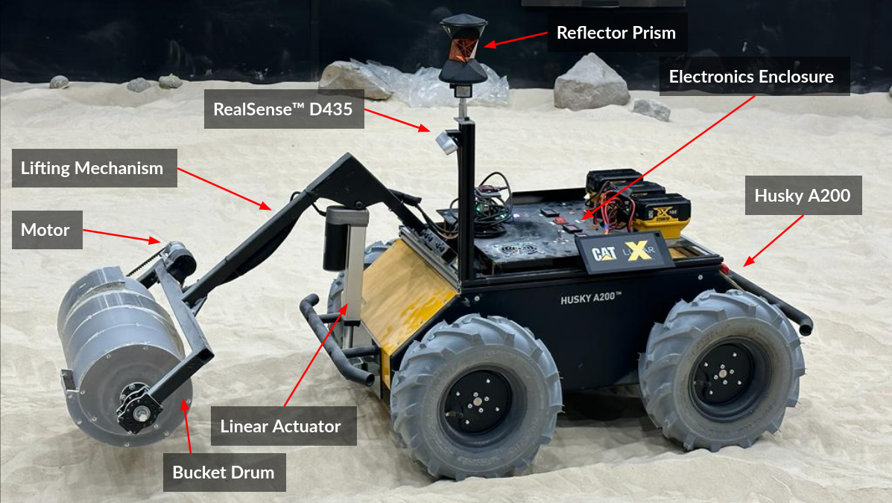

# LunAR-X
CMU Robotics Institute MRSD Capstone Project on proof-of-concept autonomy for lunar excavation and construction using the bucket-drum mechanism.

Sponsors: Dr. Red Whittaker & Caterpillar Inc.

## Links

[Autonomous Construction Video](https://youtu.be/K5EVVUZiYIY?si=wCoykAy380Cjhcy1 "Autonomous Construction Video") \
[Fall Demo Video](https://youtu.be/73hYkyyXxlk?si=YuJS1wOkK5Dod5vl "LunAR-X Project Demo") \
[Summary Video](https://youtu.be/YWWGcqENcMo?si=QFkfXnOt3Akx8KUg "Summary Video") \
[Project Report](./media/Final_Report.pdf "LunAR-X Project Report") \
[Project Website](https://mrsdprojects.ri.cmu.edu/2023teamc/ "LunAR-X Website")

## Instructions
### Initialization
1. Start and enter the container with `sudo docker-compose up --build`
2. `bash scripts/lx.sh`
3. Before unlocking rover, press both joystick triggers to start joy data stream
4. Unlock rover using GUIDE button
5. Verify system functionality using LED status indicators and teleoperation
6. Have Total station set up and calibrated for localization
7. Use control station to provide berm goal configuration, excavation zones and restricted zones on Rviz2 screen
8. Robot starts autonomous construction

## Joystick Layout
- GUIDE Button : Lock/Unlock rover
- START Button : Operation mode
- BACK Button : Task mode
- Left Stick : Mobility controls
- Right Stick : Linear actuator/lifting controls
- Left Trigger : Drum -ve
- Right Trigger : Drum +ve
- A Button : Start mapping switch
- B Button : Stop mapping switch

